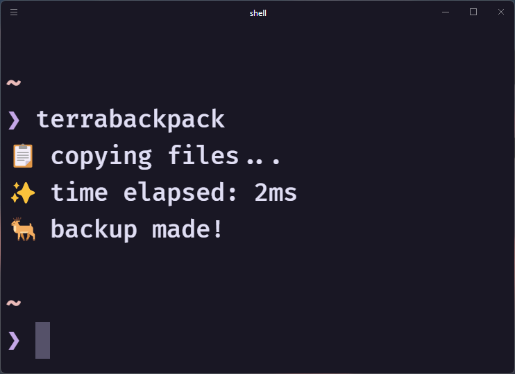

# 🦌 Terrabackpack

Scripts to quickly backup your Terraria worlds and players.


## Install 😎

**To run these scripts you need to have [deno](https://deno.land/) installed on your system.**  
Install:

```
git clone https://github.com/wyvernbw/terraria-backup
deno install --allow-read --allow-write --allow-env -n terrabackpack index.js
```

For ease of use add `.deno/bin` to your PATH. You can do that with the command provided by deno install.

### Easy mode 🤓

If you don't want to `deno install` you can use the provided tasks.
See all tasks with `deno task`.

```
git clone https://github.com/wyvernbw/terraria-backup
deno task start
```

### Lazy mode (quick) 🚗💨

**NOT RECOMMENDED**
You can run the scripts off github directly.

```
deno install --allow-read --allow-write --allow-env -n terrabackpack https://raw.githubusercontent.com/wyvernbw/terrabackpack/main/index.js
```

See below for usage.

## Usage

After first installing the script, run

```
terrabackpack setup
```

When you want to back your files up, run

```
terrabackpack
# or
terrabackpack backup
```
